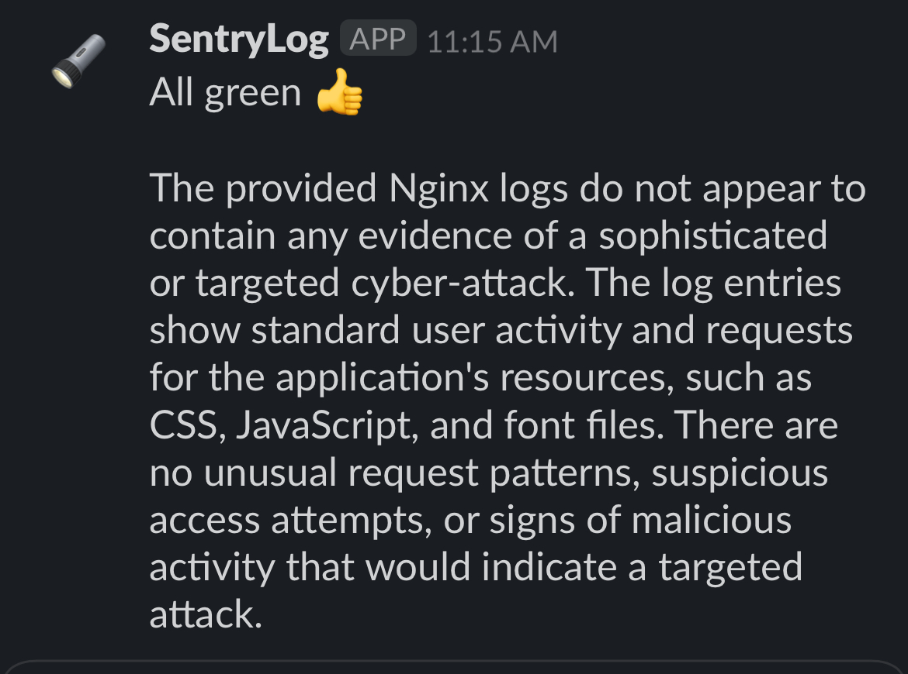

# SentryLog

## Overview
SentryLog is a Python-based application that taps directly into the logs of running Docker containers without requiring any modifications to the containers themselves. It's a real-time log monitoring tool designed to assist developers by reducing the effort needed to monitor logs and detect patterns that might otherwise go unnoticed.




The application leverages the latest advances in AI, with a connector currently implemented for Anthropic's Claude model. This AI-powered analysis provides an additional layer of insight into your container activities.

The results of the AI analysis are logged to Slack, providing an easily accessible and real-time overview of what happens in your deployment. SentryLog is not intended to replace developers monitoring logs but rather to serve as a helpful tool that enhances the efficiency and effectiveness of log monitoring.

SentryLog is in its early stages and currently monitors Nginx logs. Contributions to expand its capabilities are welcome. 

## Requirements
- Anthropic Claude API key (for AI analysis)
- Slack token for your organization (for logging results)
- A deployment that runs nginx, otherwise you won't see any logs ;-)

## Getting Started

### Prerequisites
Setup the following environment variables:
- `ANTHROPIC_API_KEY`: Your Anthropic Claude
- `ANTHROPIC_MODEL_ID`: The model you want to use for AI analysis (optional default: `claude-3-haiku-20240307`)
- `SLACK_TOKEN`: Your Slack token
- `SLACK_CHANNEL`: The Slack channel where you want to log the results

### Building and Running SentryLog
1. **Clone from git and run directly **
   
   Clone this repository to your local machine:
   ```bash
   git clone git@github.com:GrgrLmml/sentrylog.git
   cd sentrylog
   pip install -r requirements.txt
   python src/sentry.py
   ```

2. **Pull from Docker Hub**
  The image is available on Docker Hub, so you can pull it directly:
    ```bash
    docker pull grgrlmml/sentrylog:latest
   ```
3. **Add the service to your `docker-compose.yml`**
    
    Add the log watcher service to your existing `docker-compose.yml` file:
    ```yaml
    version: '3.8'
    services:
      sentrylog:
         image: grgrlmml/sentrylog:latest
         volumes:
            - /var/run/docker.sock:/var/run/docker.sock
         environment:
            - ANTHROPIC_API_KEY=your-anthropic-api-key
            - SLACK_TOKEN=your-slack-token
            - SLACK_CHANNEL=your-slack-channel
         restart: always
    ```

## Usage
Once SentryLog is running, it will start monitoring the logs. The AI analysis results will be logged to the specified Slack channel.

## Contributing
Contributions to this project are welcome. Please ensure to follow best practices and provide tests for new features.

